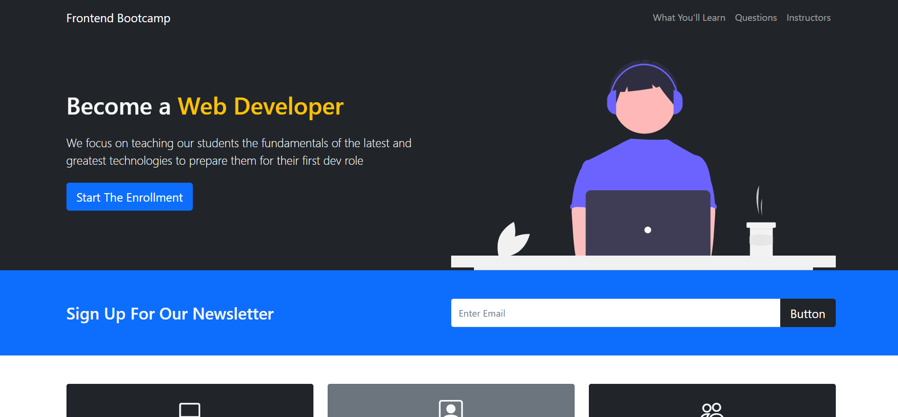
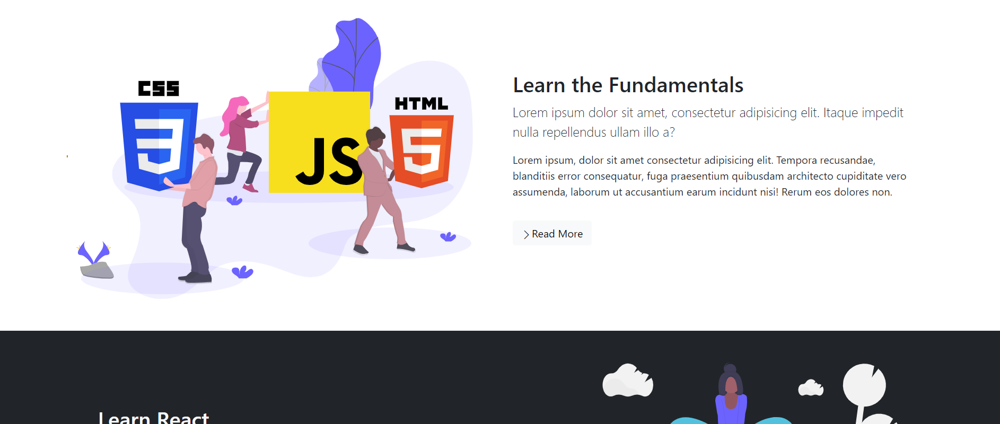
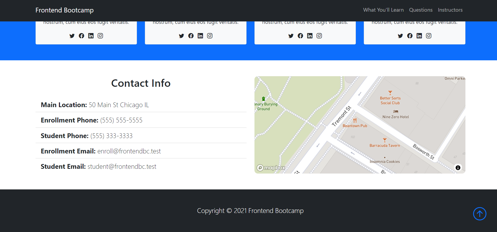

# Bootstrap 5 Website

Bootstrap 5 Website

<!-- Live link to deployed app -->

Repository: https://github.com/Mdudzik92/bootstrap-5 
Deployed app: https://mdudzik92.github.io/bootstrap-5/

<!-- Technologies used -->

HTML, CSS, Bootstrap, Web API

<!-- Explanation of what the app is -->

This is a web page for a business designed with Bootstrap 5. It's completely responsive and utilizes both Flexbox (in the Showcase and Newsletter areas) and CSS Grid. Bootstrap 5's new icons are also included as well as an accordion, cards, the Mapbox API and a modal.

<!-- Screenshot -->

<!-- License -->

MIT

<!-- Contact information -->

Email: mdudzik92@gmail.com
